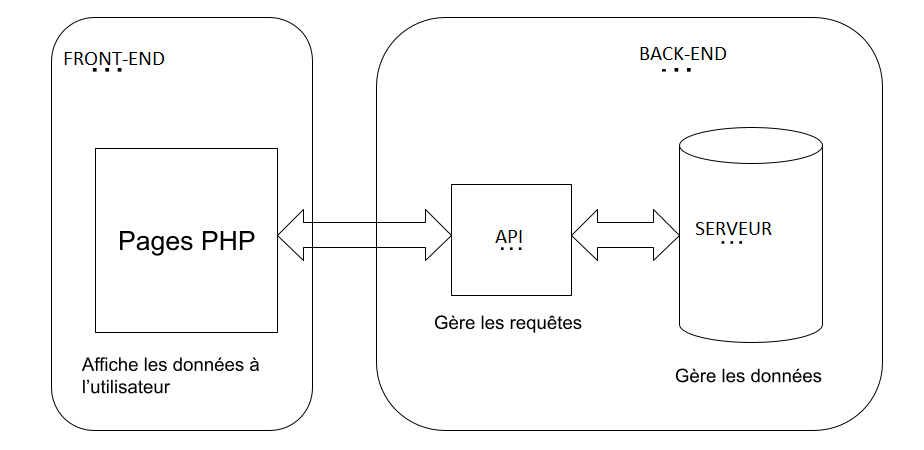
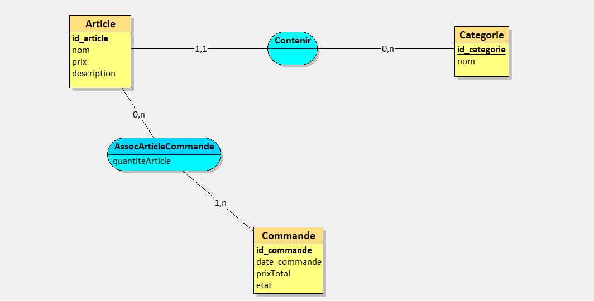
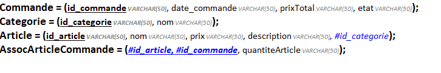
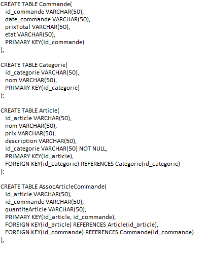

# **Projet : EatSmart**

**Etudiant :** Abdelli

---

### **1. Schéma du projet**

---

### **3. Fonctionnalités principales**

#### **3.1 Frontend (eatSmartFront)**

- **Fonctionnalité 1 :**
  La première fonctionnalité du front-office est l'interface de connexion.
  
- **Fonctionnalité 2 :**  
  La  deuxième fonctionnalité du front-office est le suivi du statut de la commande
  (péparation, prêt, servi) en temps réel.
  
#### **3.2 Backend (eatSmartBack)**

- **Fonctionnalité 1 :**  
   La  première fonctionnalité du back-office est la gestion des utilisateurs.
  
- **Fonctionnalité 2 :**  
  La  deuxième fonctionnalité du back-office est la gestion des produits.

---

### **4. Technologies utilisées**

- **Frontend :** HTML, CSS, JS, PHP
- **Backend :** API
- **Base de données :** SQL

---

### **5. Schéma du Modèle Conceptuel de Données (MCD)**

### **6. Schéma du Modèle Logique de Données (MLD)**

### **7. Schéma du Modèle Physique de Données (MPD)**

